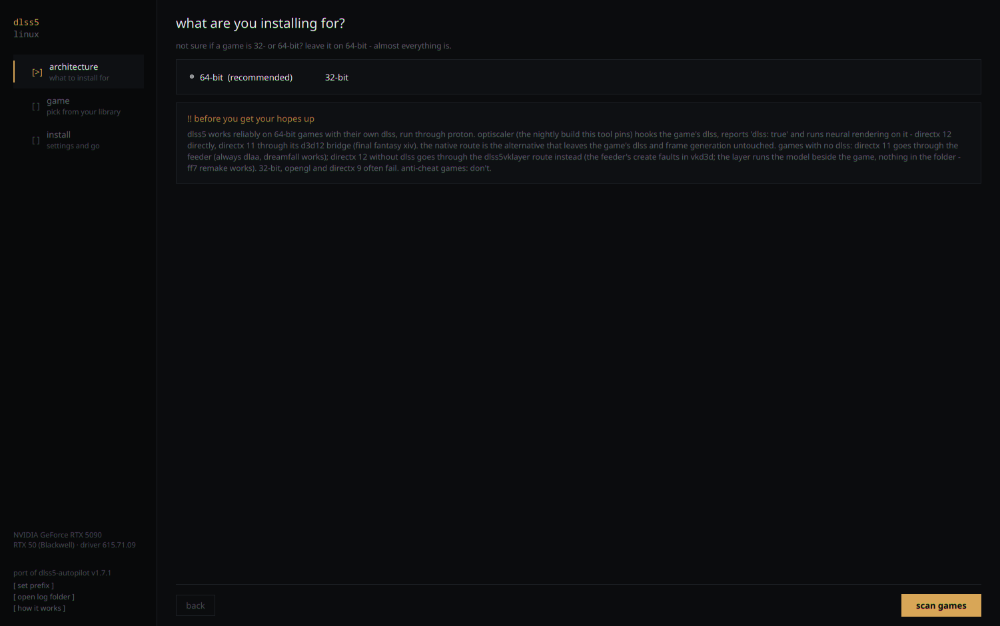
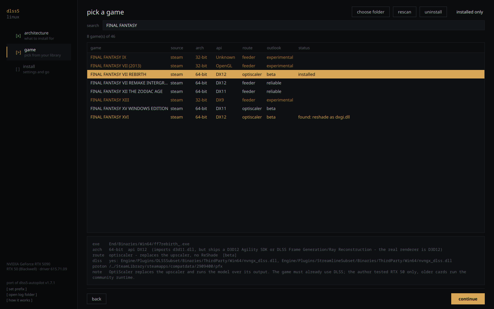
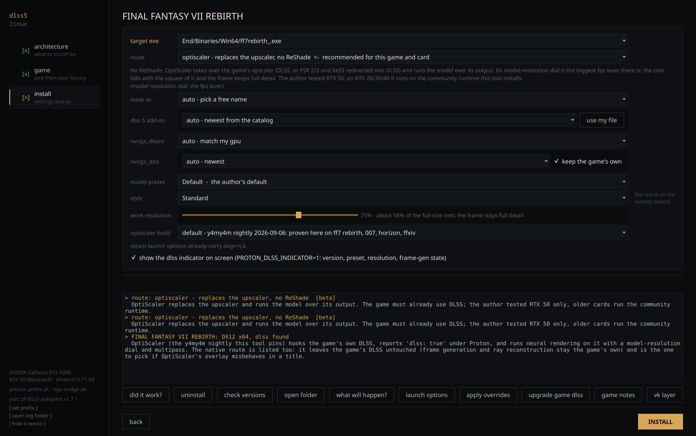
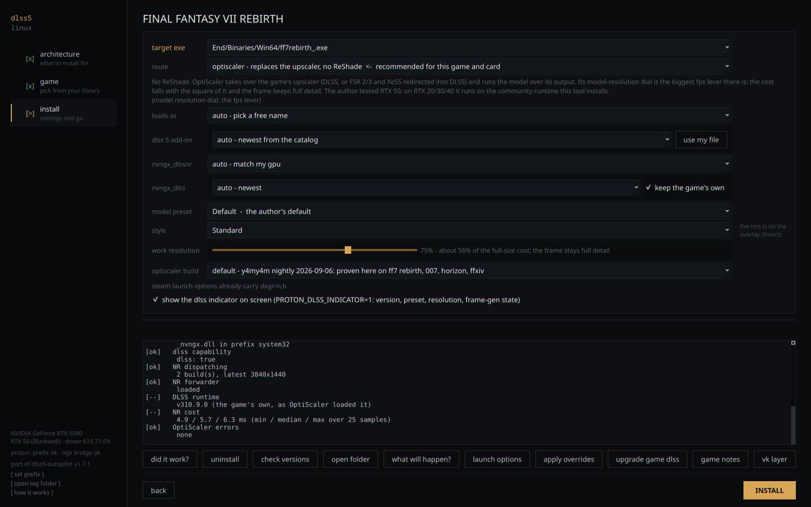
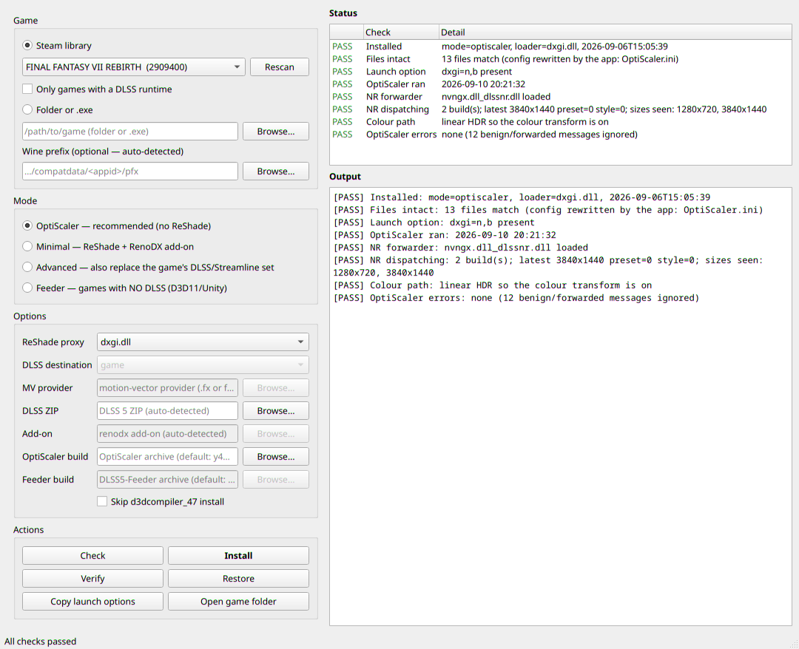

# dlss5-linux

DLSS 5 neural rendering for games running under Proton on Linux: a small
engine, a CLI and a PySide6 GUI that pick the right injection route for a
game, install it, write the Proton launch configuration, and read the logs
back to tell you whether it worked.

The engine is a Linux port of [DLSS5-Autopilot](https://github.com/Kizzuwatnaa/DLSS5-Autopilot)
(Windows, MIT): its `core/` is vendored unmodified and everything Linux-specific
lives in `linuxport/`, so upstream updates drop in. Alongside it sits the older
standalone tool (`proton-tool/dlss5_proton.py`) that the port still calls for
Proton-specific work: prefix discovery, Steam launch options, and swapping a
game's own DLSS runtimes.

Tested on an RTX 5090 with proton-cachyos 11 and GE-Proton 11, NVIDIA
610.57 and 615.71 (Sept 2026). Everything here is experimental community
tooling around a leaked NVIDIA runtime; nothing is official, and none of the
binaries are redistributed by this repository.

## What works (measured, not assumed)

| game | api | route | result |
|---|---|---|---|
| FINAL FANTASY VII REBIRTH | D3D12 + DLSS | OptiScaler (nightly) | DLSS 310.9.0 + NR, HDR, NR 4.9-6.3 ms at 3840x1440 |
| 007 First Light | D3D12 + DLSS | OptiScaler (nightly) | works; the build that fixed the v0.2.x deadlock |
| Horizon Forbidden West | D3D12 + DLSS | OptiScaler as winmm.dll | works |
| Stellar Blade | D3D12 + DLSS | native (ReShade + RenoDX) or OptiScaler | both work; native keeps the game's FG |
| FINAL FANTASY XIV | D3D11 + DLSS | OptiScaler dx11on12 bridge | works via XIVLauncher-RB + umu, see findings |
| Dreamfall Chapters | D3D11, no DLSS | feeder (private D3D12 device) | works, DLAA |
| FINAL FANTASY VII REMAKE | D3D12, no DLSS | feeder (same-device) | does not work: create faults in vkd3d-proton |
| FINAL FANTASY VII REMAKE | D3D12, no DLSS | DLSS5VKLayer (out of process) | works: nothing in the game folder, the model runs beside the game |
| Cyberpunk 2077 (GOG, RED4ext) | D3D12 + DLSS | OptiScaler | livelock; incompatible with the mod stack |

`FINDINGS.md` has the why for each row and the dead ends, so nobody repeats them.

## Five routes, one of them outside the game

Four routes put something in the game folder: OptiScaler as a proxy DLL, or
ReShade with the feeder / native / bridge add-ons. The fifth,
[DLSS5VKLayer](https://github.com/bmitch87/DLSS5VKLayer), is a Linux Vulkan
layer that hands each presented frame to a helper running the model under a
Proton runner and takes the result back. It reaches what the others cannot:
native Linux Vulkan games, and D3D12 games without DLSS, where the feeder's
same-device create faults under vkd3d-proton. It costs what a post-present
route costs: synthetic motion vectors from optical flow, no depth, the HUD
included, no upscaling. A game with its own DLSS is still better served by
OptiScaler. `examples/vklayer/README.md` is the recipe; the port knows the
route (`vklayer status`, `launch-options --vklayer`, `verify --vklayer`)
without installing it, names the neural-rendering runtime by hash, and ships
`vklayer-run`, a launch-option wrapper that starts the layer's helper with
the game and stops it after (the layer does neither, and an idle helper
costs a fifth of a core). Run 0.3.0-2 or newer: older builds can hang the GPU on a 1x1 probe swapchain, and
stall the present thread once a second when a toggle hotkey is bound. What
the route costs per frame, measured, is in `FINDINGS.md`.

## Screenshots

The port's wizard, three pages. Taken offscreen on the test machine with the
library filtered to the titles this README reports on; drive labels in paths
are shortened.



Pick a game: source, architecture, renderer, the recommended route and its
outlook, install state, and the detection evidence for the selected title.



Install: route, proxy, add-on and runtime choices, the model-resolution dial,
the OptiScaler build pin, and the launch-option check, with the reasoning in
the log below.



"did it work?" reads the logs of the last run: capability, dispatches, the
DLSS runtime the game loaded, neural-rendering cost, errors.



The standalone tool's own window (`proton-tool/dlss5_gui.py`): mode, options,
and a verify against the same game.



## Install

### The AppImage

One file, nothing to install. It carries its own Python, Qt and 7-Zip, which is
what makes it work on a Steam Deck and the other read-only distributions: they
have no package manager to install p7zip with, and the OptiScaler nightlies are
`.7z`, so without a bundled one the route that works best under Proton is the
one that cannot be unpacked there.

```bash
chmod +x dlss5-linux-*-x86_64.AppImage
./dlss5-linux-*-x86_64.AppImage                 # the three-page wizard
./dlss5-linux-*-x86_64.AppImage --cli --scan    # the command line
```

It still needs what it cannot carry: Steam or another Proton launcher, and an
NVIDIA driver holding `nvngx_dlssnr.dll`. Components are downloaded from their
own publishers at run time as they always were, and archives you keep by hand
go in `$DLSS5_COMPONENTS_DIR` (default `~/.local/share/dlss5-linux/components`).

Two things it is careful about. Everything it runs - `wine`, `protontricks`,
`nvidia-smi`, `flatpak` - runs with your environment, not the bundle's. And
`launch-options --vklayer` writes a path that outlives the AppImage's mount
point, because Steam keeps launch options for months and that mount is gone the
moment the tool exits.

Built with `bash packaging/build-appimage.sh`; the interpreter and 7-Zip are
pinned by sha256 in `packaging/pins.lock`.

### From the checkout

Requirements: Python 3.11+, `PySide6` for the GUI, `7z` (p7zip) for the
OptiScaler nightly archives, Steam or a Proton launcher, an NVIDIA driver that
carries `nvngx_dlssnr.dll` (or the runtime archive next to the tools).

```bash
git clone https://github.com/pantsoftime/dlss5-linux
cd dlss5-linux/dlss5-linux
python3 dlss5_linux.py --scan                 # every Steam game with its route
python3 dlss5_linux.py recommend "Stellar Blade"
python3 dlss5_linux.py install "Stellar Blade" --indicator
python3 dlss5_linux.py launch-options "Stellar Blade" --apply   # Steam closed
python3 dlss5_linux.py verify "Stellar Blade"                    # after one launch
python3 dlss5_gui_linux.py                    # the same, as a three-page wizard

python3 dlss5_linux.py vklayer status         # the out-of-process route: layer, helper, runtime
python3 dlss5_linux.py launch-options "FINAL FANTASY VII REMAKE" --vklayer --apply
python3 dlss5_linux.py verify "FINAL FANTASY VII REMAKE" --vklayer
```

Non-Steam games take a folder or `.exe` (`--prefix` for the Wine prefix if it
cannot be derived). Final Fantasy XIV through XIVLauncher-RB is detected and
its `launcher.ini` overrides are written by `launch-options --apply`.

### Builds and pins

* `--optiscaler default` is the y4my4my4m fork nightly of 2026-09-06 (build
  7b7220bb). Upstream's `nightly` tag rolls daily, so the pinned hash only
  matches that day's asset: keep the archive next to the tools, or point
  `--optiscaler` at a local `.zip`/`.7z`. `fallback` is Dagherbou v0.1.2,
  `latest` whatever Dagherbou publishes (v0.2.x deadlocked under Proton here).
* `dlls <game> install` swaps the game's own DLSS SR/RR/FG runtimes for the
  newest archive beside the tools; Streamline is left alone on purpose.
  `dlls <game> restore` undoes it. NVIDIA publishes the three files in its
  own repository (tag `v310.9.1` at the time of writing, under
  `lib/Windows_x86_64/rel/`); a zip of them next to the tools is picked up as
  the newest source. 310.9.1 is verified on 007 First Light (dlss: true, NR at
  5120x1440 DLAA, ~6 ms).
* The neural-rendering runtime, `nvngx_dlssnr.dll`, is not in any SDK and
  not shipped here. Know which build you have by hash: the NVIDIA-signed 310.8
  for RTX 50 is `e16bcf15...`, ShortFuse's cross-generation build for RTX
  20/30/40 is `e67dee20...`, and a widely copied patched build `8270b350...`
  carries NVIDIA's signature over different content. `vklayer status` and
  `verify --vklayer` name the one the helper loads.
* The feeder pin is DLSS5-Feeder 0.14.0-beta.5 (Dreamfall Chapters, D3D11, VORT
  vectors, classic RenoDX add-on); v0.12.0 is kept as the previous known-good.
  0.15.1 (PQ bridge for HDR10 D3D11 swapchains, OptiScaler accepted as a feed
  consumer) is the next candidate once it has had one Dreamfall run.
* `scan_updates.py` lists what moved upstream across every project this
  depends on, DLSS5VKLayer included. Run it before moving a pin; test a new
  build on one game first.

## Layout

```
dlss5-linux/            the port: core/ (vendored upstream), linuxport/, CLI, GUI
proton-tool/            the standalone tool the port delegates Proton work to
mv-providers/vort/      VORT motion-vector shader (MIT) for the feeder route
examples/ffxiv/         one-shot FFXIV setup under XIVLauncher-RB + the ini keys
examples/vklayer/       the out-of-process route: install, launch token, controls, caveats
scan_updates.py         upstream release watcher
FINDINGS.md             what was learned, per route and per failure
```

## Credits

DLSS5-Autopilot (Kizzuwatnaa), OptiScaler and the DLSS-NR forks (Dagherbou,
y4my4my4m, wilsjo2, SirenBrink), DLSS5-Feeder (jlrouzies-fr), DLSS5VKLayer
(bmitch87), RenoDX (clshortfuse), the RHI build catalogue (RankFTW),
vort_Shaders (vortigern11), dxvk-nvapi and vkd3d-proton.
